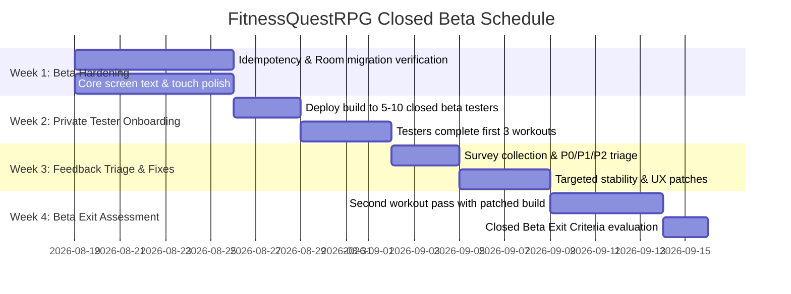

# FitnessQuestRPG Closed Beta Readiness Plan

> **Milestone:** Closed Beta Ready  
> **Target Audience:** Small Private Test Group (5–10 real exercisers)  
> **Current Version:** Build 410 (Phone) / 411 (Wear OS) — Version Name: 0.12.0  
> **Core Objective:** Validate workout safety, progression integrity, and player motivation

---

## 1. Closed Beta Mission & Player Promise

> **"FitnessQuestRPG turns real workouts into meaningful character progression, loot, and a hero that visibly grows with the player."**

The Closed Beta is designed to validate safety, usability, and motivation in real-world training conditions before any open beta or public release.

### Key Milestones & Platform Guardrails
- **Immediate Milestone:** Closed Beta with 5–10 active exercisers across 7 days.
- **Future Milestones:** Open Beta and Production are subsequent decision gates that require meeting all Closed Beta exit criteria.
- **Phone-Only Completeness:** The Android phone app must provide a 100% complete, standalone workout and RPG experience.
- **Wear OS as Optional Companion:** Wear OS companion is optional and designed to fail gracefully without blocking or desynchronizing phone workouts.
- **Optional Local AI:** On-device AI features are optional enhancements and must never block workout logging, reward calculations, or app startup.

---

## 2. Closed Beta Tester Mission & Feedback Protocol

### Tester Mission
Each closed beta tester is asked to complete **at least 3 real workouts over a 7-day test period** (mixing strength, cardio, or bodyweight routines) using their normal training environment.

### Feedback Questions
Testers will be surveyed at the end of their test cycle on:
1. **Starting & Logging:** Could you start, log, edit, and finish a workout without help?
2. **Data Integrity:** Did any workout, XP, reward, inventory item, equipment state, or progress duplicate or disappear?
3. **Usability & UI:** Was any screen confusing, hard to read, or difficult to tap?
4. **Motivation:** Did earning RPG rewards make you more likely to work out again?
5. **Friction Points:** What was the most frustrating moment during your workout or review?
6. **Retention:** Would you continue using the app for another week? Why or why not?
7. **Environment:** What device, Android version, and wearable device (if any) did you use?

---

## 3. Issue Severity Rubric

All issues discovered during Closed Beta testing are triaged according to this rubric:

| Severity | Definition | Beta Action |
|---|---|---|
| **P0** | Crash, data loss, duplicate workout / reward / inventory, privacy or security vulnerability | **Closed Beta Blocker** — Must fix before wider distribution |
| **P1** | Blocks workout completion, breaks core progression math, or prevents basic comprehension of key screens | **Closed Beta Blocker** — Must fix before beta exit |
| **P2** | Significant usability friction, awkward ergonomics, or demotivating UX impediment | **Beta Polish** — Resolve or clearly mitigate during beta |
| **P3** | Minor cosmetic defect, polish nuance, enhancement, or post-launch feature request | **Post-Beta** — Tracked on roadmap; do not delay beta |

---

## 4. Closed Beta Scope Boundaries

### A. Closed Beta Core (Must Be Rock-Solid)
- **Onboarding & First Session:** Smooth entry, intuitive class picking, immediate route into a workout without forced network login.
- **Workout & Session Integrity:** Rock-solid manual logging, exercise swapping, set editing, rest timers, and crash-resilient session restoration.
- **Deterministic RPG Rewards:** XP, Gold, Energy, and equipment drops calculated and awarded exactly once per session (idempotent finalization).
- **Hero & Equipment Loop:** Equipping 5-piece gear slots (Head, Chest, Hands, Legs, Feet) visibly updates the 14-layer Paper-Doll avatar and character stats.
- **Clear Next Objective:** Distinct guidance for the next workout (Biome boss readiness, stat allocation, or mastery milestone).
- **Save & Offline Safety:** Room database (v30 schema), offline-first operation, safe pending sync queues, and zero progress loss across restarts.
- **Diagnostics & Error Reporting:** Firebase Crashlytics logging with obfuscated crash mapping and user-friendly error fallbacks.

### B. Post-Beta Scope (Preserved in Codebase & Roadmap, Non-Blocking)
- Dynamic runtime AI generation for gear drops or custom enemies.
- Screenshot OCR routine import engine.
- Web-based Firestore moderation and catalog management tooling.
- Extended class transformations (e.g. Druid Treant Form expansion) beyond core Wild Shape.
- Real-time multiplayer raids, guild hubs, and deep PvP seasons.
- Broad endgame trait/relic tree expansions.

---

## 5. Prioritized Closed Beta Blockers & Polish

| ID | Severity | Problem & User Impact | Affected Files | Acceptance Criteria | Verification Command |
|---|---|---|---|---|---|
| **CB-P0-1** | P0 | Potential duplicate reward application if workout finalization is tapped rapidly | `GameRepository.kt`, `ActiveSessionScreen.kt` | Session finalization is idempotent via unique receipt check; duplicate taps return identical receipt safely. | `.\gradlew.bat test --tests *ActiveSessionTest*` |
| **CB-P0-2** | P0 | Rapid tapping on offline reward claim could trigger multiple award dispatches | `GameRepository.kt`, `RewardRevealDialog.kt` | Offline rewards marked claimed transactionally before state emission. | `.\gradlew.bat test --tests *Progression*` |
| **CB-P0-3** | P0 | Room database migration safety: ensure legacy saves (v1–v29) upgrade cleanly to v30 | `AppDatabase.kt` | All Room migrations (v1 through v30) pass migration tests preserving character and inventory. | `.\gradlew.bat test` |
| **CB-P1-1** | P1 | Cardio logging row cramped on narrow phones with undersized log button | `ActiveSessionScreen.kt` | Cardio log action is accessible, prominent, and meets 48dp minimum touch target. | `.\gradlew.bat :app:assembleDebug` |
| **CB-P1-2** | P1 | Settings Save button misleadingly only saved API key | `SettingsDialog.kt` | Renamed to "Done"; API key auto-saves on change. *(Completed)* | `.\gradlew.bat test` |
| **CB-P1-3** | P1 | Play SDK raw status/error codes shown to users on local model download failure | `SettingsDialog.kt` | Raw diagnostics guarded behind `BuildConfig.DEBUG`. *(Completed)* | `.\gradlew.bat test` |
| **CB-P2-1** | P2 | Wear OS stepper ± buttons below 48dp touch target standard | `WearApp.kt` | Stepper buttons enlarged with padded touch bounds for reliable wrist taps. *(Completed)* | `.\gradlew.bat :wear:assembleDebug` |
| **CB-P2-2** | P2 | Critical text clipping on core screens (Onboarding, Session, Rewards, Hero) | `RewardRevealDialog.kt`, `HeroScreen.kt`, `ActiveSessionScreen.kt` | Critical text elements paired with `TextOverflow.Ellipsis` and bounded lines. | `.\gradlew.bat :app:assembleDebug` |

---

## 6. Closed Beta Exit Criteria

Do **NOT** proceed to Open Beta or Production until all of the following exit conditions are satisfied:
1. **Zero Recurring P0/P1 Failures:** The 5–10 tester group completes multiple workout cycles over 7+ days with zero data loss, crash loops, or duplicate reward bugs.
2. **Core Loop Comprehension:** 100% of testers successfully complete the loop: **Workout → RPG Reward Reveal → Equip/Inspect Gear on Avatar → Identify Next Objective**.
3. **Resilience Validated:** Confirmed clean recovery from backgrounding, process termination during workouts, network disconnects, and app restarts.
4. **Crash & Feedback Pipeline Active:** Crashlytics captures diagnostic metadata cleanly and user feedback is collected without friction.
5. **Actionable P1/P2 Mitigations:** All high-frequency P1 and P2 feedback items from the beta group have verified fixes or clear UX mitigations in place.
6. **Positive Motivation Evidence:** Testers indicate that workout gamification and avatar progression gave them tangible incentive to return for subsequent workouts.

---

## 7. Closed Beta Test Matrix

| Environment | Configuration | Target Verification |
|---|---|---|
| **Compact Phone** | 5.4"–5.8" (1080×2340), Font Scale 1.3× | Cardio field rows, dialog sizing, navigation bar inset clearance |
| **Standard Phone** | 6.1"–6.7" (1080×2400), Font Scale 1.0× | Core workout logging, paper-doll avatar rendering, reward reveals |
| **Offline Mode** | Airplane mode enabled | 100% local persistence, pending Firestore sync queue, battle engine |
| **Wear OS (Optional)** | 1.2"–1.4" Round AMOLED (Pixel Watch / Galaxy Watch) | Safe fallback if disconnected, glanceable metrics, >=32dp stepper targets |

---

## 8. 4-Week Closed Beta Execution Roadmap

